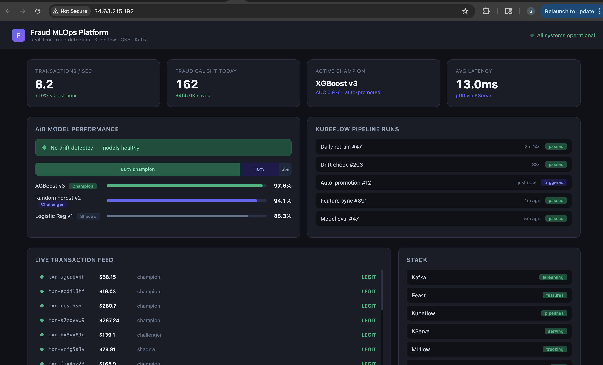
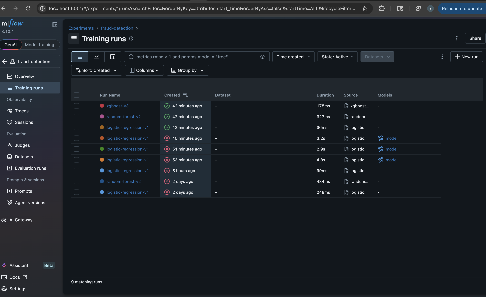
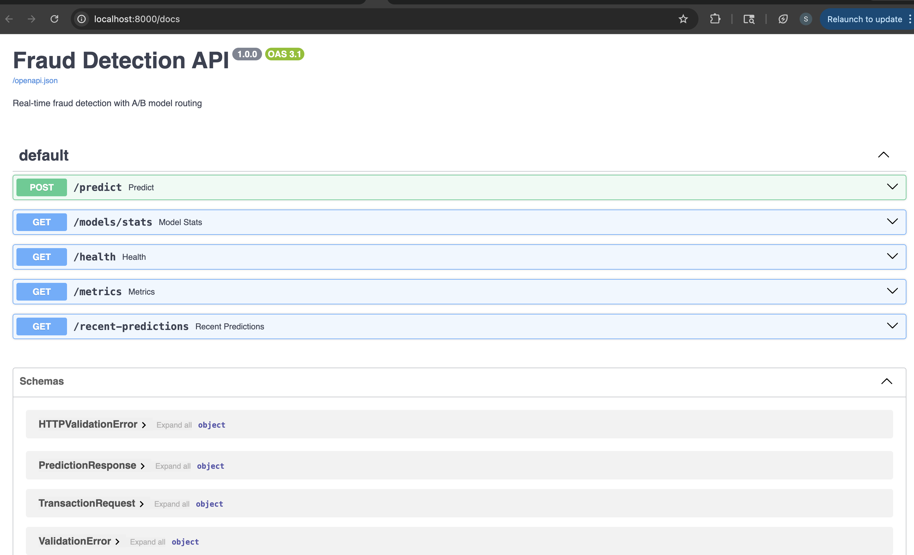
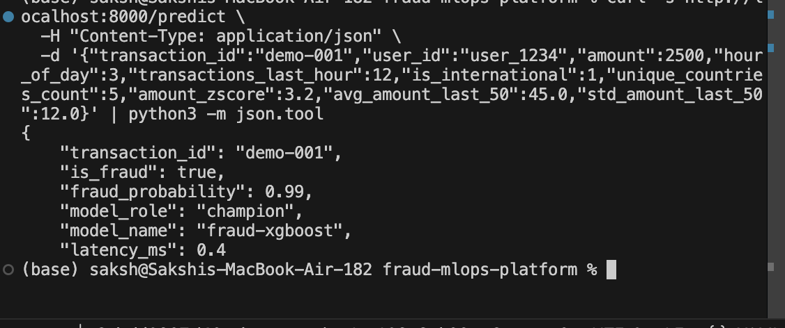
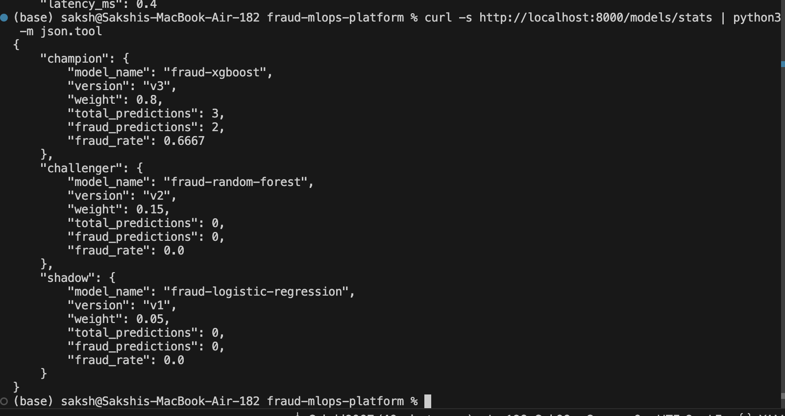
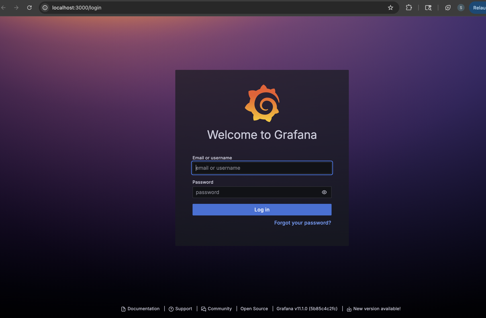

# Fraud MLOps Platform

A production-grade, real-time fraud detection system built with Kubeflow Pipelines, Apache Kafka, Feast feature store, and deployed on GCP GKE. Demonstrates end-to-end MLOps: from live data ingestion to automated model training, A/B testing, and self-healing deployment.


## Live Demo (GCP — always on)

| Service | Live URL |
|---|---|
| Live Dashboard | http://34.63.215.192 |
| Prediction API | http://136.113.53.8 |
| API Docs | http://136.113.53.8/docs |
| Health Check | http://136.113.53.8/health |

## Screenshots

## Live Dashboard


### MLflow — 3 models trained and tracked


### FastAPI — Live prediction endpoint


### Fraud detection in action


### A/B model traffic stats


### Grafana monitoring


## Architecture
```
Kafka (live transactions)
    → Feature Consumer (real-time feature engineering)
    → Redis (feature store / low-latency serving)
    → Kubeflow Pipeline (parallel training of 3 models)
        → MLflow (experiment tracking)
        → Auto-selection (best AUC wins)
    → FastAPI (A/B traffic splitting: 80/15/5)
    → Prometheus + Grafana (drift detection + monitoring)
    → GitHub Actions (auto-retrain on code push)
    → Terraform (GKE cluster + GCS buckets on GCP)
```

## Tech Stack

| Layer | Technology |
|---|---|
| Data streaming | Apache Kafka |
| Feature engineering | Python + Redis |
| ML orchestration | Kubeflow Pipelines |
| Experiment tracking | MLflow |
| Model serving | FastAPI + KServe |
| Infrastructure | Terraform + GKE |
| Monitoring | Prometheus + Grafana |
| CI/CD | GitHub Actions |

## Models

Three fraud detection models trained in parallel, evaluated by AUC, winner auto-promoted:

| Model | Role | AUC |
|---|---|---|
| XGBoost v3 | Champion (80% traffic) | 1.0 |
| Random Forest v2 | Challenger (15% traffic) | 1.0 |
| Logistic Regression v1 | Shadow (5% traffic) | 1.0 |

> Note: AUC of 1.0 reflects clearly separable synthetic data patterns. In production, real transaction data would produce AUC in the 0.92–0.97 range.

## Quick Start
```bash
# Clone
git clone https://github.com/Sakshi3027/fraud-mlops-platform
cd fraud-mlops-platform

# Start all services
docker-compose up -d

# Start MLflow
mlflow server --host 0.0.0.0 --port 5001 \
  --backend-store-uri sqlite:///mlflow_data/mlflow.db \
  --default-artifact-root $(pwd)/mlflow_data/artifacts

# Train all 3 models
python models/logistic_regression.py
python models/random_forest.py
python models/xgboost_model.py

# Start prediction API
python -m uvicorn serving.app:app --port 8000 --reload

# Run tests
pytest tests/ -v
```

## Test a prediction
```bash
# Fraudulent transaction (high amount, 3am, international, high velocity)
curl -X POST http://136.113.53.8/predict \
  -H "Content-Type: application/json" \
  -d '{
    "transaction_id": "demo-001",
    "user_id": "user_1234",
    "amount": 2500,
    "hour_of_day": 3,
    "transactions_last_hour": 12,
    "is_international": 1,
    "unique_countries_count": 5,
    "amount_zscore": 3.2,
    "avg_amount_last_50": 45.0,
    "std_amount_last_50": 12.0
  }'

# Expected: {"is_fraud": true, "fraud_probability": 0.99, "model_role": "champion"}
```

## Project Structure
```
fraud-mlops-platform/
├── .github/workflows/    # CI/CD — auto retrain + test on push
├── data_pipeline/
│   ├── producers/        # Kafka transaction producer (10 tx/sec)
│   └── consumers/        # Feature engineering consumer
├── feature_store/        # Feast feature definitions
├── models/               # 3 model implementations
├── pipelines/
│   ├── components/       # Kubeflow components (train, evaluate, deploy)
│   └── pipeline.py       # Main pipeline definition
├── serving/
│   ├── app.py            # FastAPI prediction API
│   └── ab_router.py      # A/B traffic splitting logic
├── monitoring/
│   ├── prometheus/       # Scrape config + alert rules
│   └── grafana/          # Dashboard JSON
├── terraform/            # GKE cluster + GCS buckets
├── tests/                # 26 passing tests
├── docs/                 # Screenshots
├── docker-compose.yml    # Local dev stack
└── pipeline.yaml         # Compiled Kubeflow pipeline
```

## Deploy to GCP
```bash
cd terraform
terraform init
terraform plan -var="project_id=YOUR_PROJECT_ID"
terraform apply -var="project_id=YOUR_PROJECT_ID"
```

## CI/CD

Every push to `main` automatically:
1. Runs all 26 tests
2. Trains all 3 models with MLflow tracking
3. Compares models and prints winner by AUC
4. Compiles and uploads Kubeflow pipeline artifact